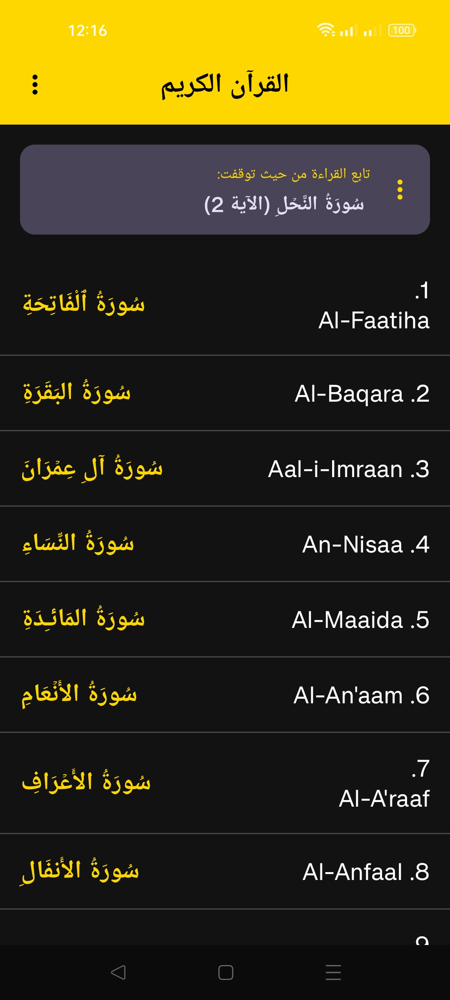
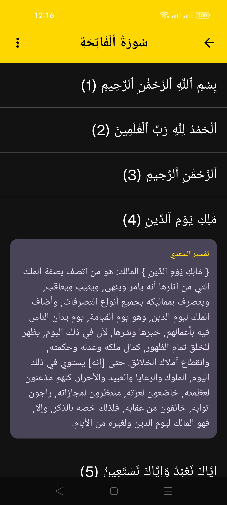
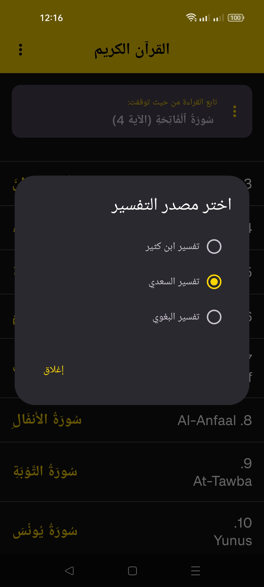

# 📖 Rozix Quran Tafseer

**Rozix Quran Tafseer** هو تطبيق أندرويد مجاني يتيح قراءة القرآن الكريم مع عدة مصادر للتفسير، ويعمل بالكامل **بدون الاتصال بالإنترنت**.

## ✨ المميزات

* 📖 قراءة القرآن الكريم كاملًا.
* 📚 دعم **3 مصادر مختلفة للتفسير**:

  * تفسير السعدي
  * تفسير ابن كثير
  * تفسير البغوي
* 🔄 إمكانية تغيير مصدر التفسير في أي وقت.
* 📍 حفظ آخر موضع وصلت إليه ومتابعة القراءة بسهولة.
* ⚡ واجهة سريعة وسلسة.
* 📱 يعمل بالكامل بدون اتصال بالإنترنت.
* 🚫 بدون أي إعلانات أو عناصر مشتتة.
* 🌙 تصميم مريح للعين أثناء القراءة.

## 🎯 هدف التطبيق

يوفر **Rozix Quran Tafseer** وسيلة بسيطة ومريحة لقراءة القرآن الكريم مع الاطلاع على التفسير مباشرة أثناء القراءة، دون الحاجة للاتصال بالإنترنت.

## 📱 لقطات الشاشة

---

## 📥 التحميل

قم بتحميل التطبيق مجانًا من متجر Google Play:

---

## 📄 الترخيص

جميع الحقوق محفوظة © **Rozix Systems**

للمزيد من المعلومات، [زر صفحة Rozix Systems على فيسبوك](https://www.facebook.com/RozixSystems)

---

**تم تطوير التطبيق بواسطة Rozix Systems.**
